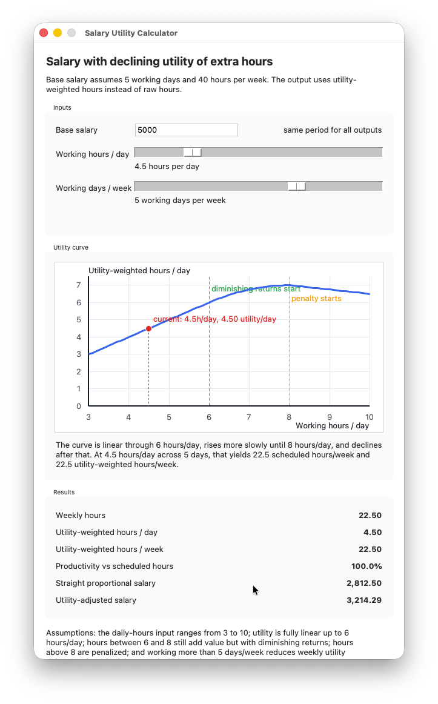

## Salary Utility Calculator

Small Tkinter GUI for comparing straight salary scaling with a utility-adjusted salary, including a live visualization of the daily utility curve.



### Assumptions

- The entered salary represents a standard schedule of `5` working days and `40` hours per week.
- Working hours are entered per day, with a slider range from `3` to `10`.
- Daily utility is fully linear up to `6` hours per day.
- Hours between `6` and `8` still add utility, but with diminishing returns.
- Hours above `8` are penalized.
- Working more than `5` days per week reduces weekly utility only when the total schedule exceeds `40` hours per week.

### Run

```bash
salary-calculator
```

After installation with `uv tool install -e .`, you can launch it directly with the command above.

You can also run it from the project directory with:

```bash
python3 main.py
```

The GUI shows:

- `Weekly hours`: calculated from `hours per day * working days`.
- `Straight proportional salary`: simple weekly-hours scaling relative to `40` hours/week.
- `Utility-adjusted salary`: salary scaled by utility-weighted hours relative to the default `40h / 5d` schedule.
- `Utility curve`: a live chart of utility-weighted hours per day versus working hours per day.
